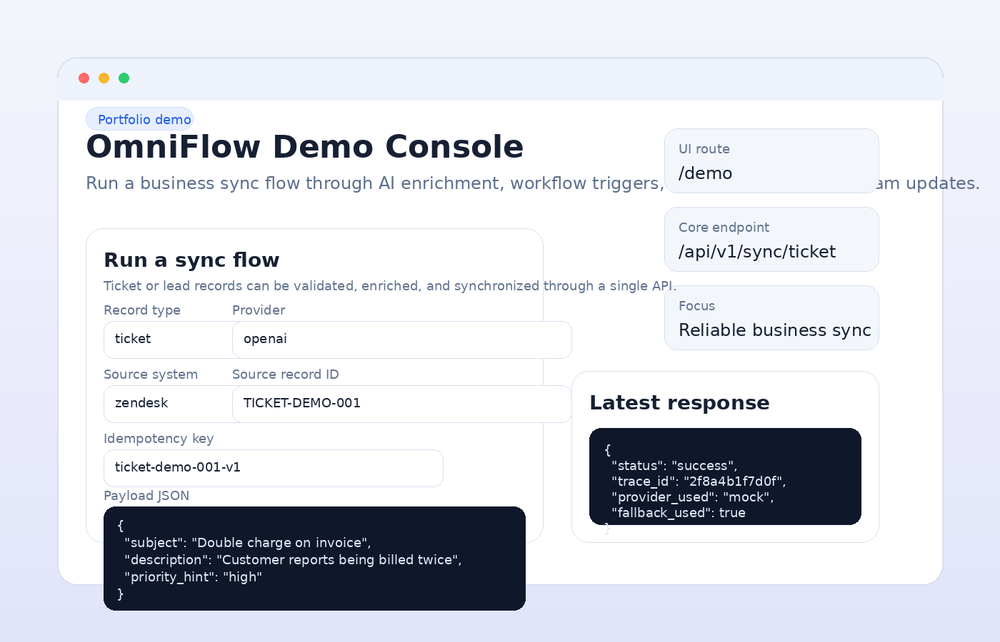
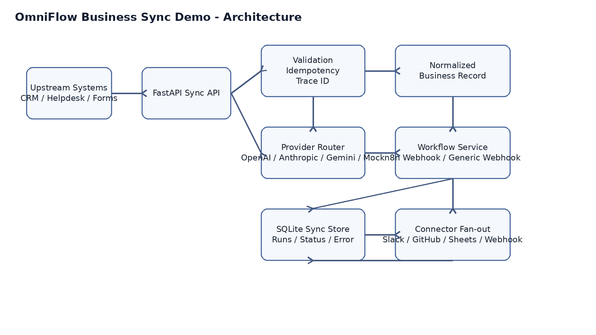
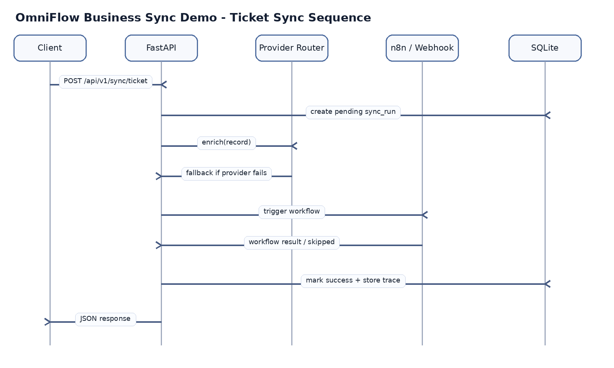

# OmniFlow Business Sync Demo

A portfolio-ready FastAPI project that shows how to **design and implement an API integration flow that connects systems and synchronizes business data more reliably**.

This repository is intentionally framed as a **business data sync / orchestration service**, not a chatbot project. AI enrichment is only one stage inside a larger flow that validates incoming records, normalizes them, triggers workflows, fans out downstream updates, and stores execution traces for inspection.



---

## Why this project exists

Teams often move business records between tools in fragile ways:

- support tickets are copied manually into Slack or issue trackers
- lead records are exported to spreadsheets and enriched by hand
- webhook logic is scattered across scripts, automation tools, and backend services
- AI enrichment is added without validation, trace IDs, fallback behavior, or replay protection

OmniFlow demonstrates a better approach:

1. receive records through a stable REST API
2. validate and normalize the request
3. enrich the record with a selected provider
4. fall back to another provider if the preferred one fails
5. trigger an n8n workflow or generic webhook
6. fan out to downstream connectors
7. persist sync status, trace metadata, and failure details in SQLite

---

## What this repo demonstrates

- FastAPI structure for an integration/orchestration backend
- provider abstraction for OpenAI / Anthropic / Gemini / Mock
- provider fallback for safer external dependency handling
- webhook-based workflow orchestration for n8n
- connector pattern for Slack / GitHub / Sheets / custom webhooks
- idempotency handling to reduce duplicate syncs
- persisted run history with trace IDs
- static front-end demo console served by the same backend
- GitHub-ready scaffold with CI, Docker, tests, docs, and sample payloads

---

## Demo use case

### Customer support ticket sync

An upstream system sends a support ticket into the API.

The service will:

1. validate the request body
2. generate or reuse an idempotency key
3. enrich the ticket through the requested provider
4. fall back if the first provider fails
5. normalize the result into a consistent business record
6. trigger an n8n workflow or webhook
7. optionally fan out to connectors
8. persist success or failure details for later inspection

This is the type of flow you can describe in a portfolio, interview, or proposal as:

> Designed and implemented an API orchestration service that connects systems and synchronizes business records with validation, provider fallback, workflow handoff, and execution tracing.

---

## Demo UI

This version includes a lightweight browser UI served directly by FastAPI.

### Available pages

- `GET /demo` — interactive demo console
- `GET /docs` — Swagger UI
- `GET /health` — basic health check

### What the demo console does

- loads sample ticket or lead payloads
- lets you switch providers
- submits a sync request to the backend
- shows the normalized response JSON
- replays the same request to demonstrate idempotency
- loads recent runs from SQLite

This keeps the project easy to run locally because there is **no separate frontend build step**.

---

## Architecture



## Sequence flow



---

## Key reliability features

### 1. Idempotency
If the same `idempotency_key` is submitted again and the earlier run succeeded, the API returns the stored result instead of creating duplicate downstream updates.

### 2. Provider fallback
If the requested provider fails, the router continues through a fallback chain. Example:

- requested provider: `openai`
- fallback order: `mock, anthropic, gemini`
- actual provider used: `mock`

The response includes requested provider, attempts, final provider, and whether fallback occurred.

### 3. Traceability
Every sync run gets a `trace_id`, is stored in SQLite, and can be inspected later through `GET /api/v1/sync/runs` or `GET /api/v1/sync/runs/{trace_id}`.

### 4. Graceful degradation
If n8n is not configured, the workflow stage is skipped instead of crashing the whole demo.

---

## Repository structure

```text
omniflow-business-sync-demo/
├─ .github/workflows/ci.yml
├─ app/
│  ├─ api/
│  ├─ connectors/
│  ├─ core/
│  ├─ db/
│  ├─ providers/
│  ├─ schemas/
│  ├─ services/
│  ├─ static/demo/
│  └─ main.py
├─ data/
│  ├─ sample_ticket_request.json
│  ├─ sample_lead_request.json
│  └─ sample_tickets.json
├─ docs/
│  ├─ api_examples.md
│  ├─ architecture.png
│  ├─ demo-ui-preview.png
│  ├─ portfolio_positioning.md
│  └─ sequence-diagram.png
├─ tests/
├─ workflows/
│  ├─ customer_ticket_sync_payload.json
│  └─ n8n_ticket_triage_workflow.json
├─ .env.example
├─ Dockerfile
├─ docker-compose.yml
├─ Makefile
├─ pytest.ini
├─ requirements.txt
└─ README.md
```

---

## Main endpoints

### Diagnostics

```bash
GET /health
GET /api/v1/sync/providers
GET /api/v1/sync/runs
GET /api/v1/sync/runs/{trace_id}
```

### Sync flows

```bash
POST /api/v1/sync/ticket
POST /api/v1/sync/lead
```

---

## Example request

```json
{
  "source_system": "zendesk",
  "source_record_id": "TICKET-10021",
  "record_type": "ticket",
  "provider": "openai",
  "idempotency_key": "ticket-10021-v1",
  "payload": {
    "customer_name": "Ava Chen",
    "customer_email": "ava@example.com",
    "subject": "Double charge on invoice",
    "description": "I was billed twice after upgrading the subscription.",
    "priority_hint": "high"
  }
}
```

### Example response when fallback happens

```json
{
  "status": "success",
  "trace_id": "2f8a4b1f7d0f",
  "idempotent_replay": false,
  "normalized_record": {
    "record_type": "ticket",
    "source_system": "zendesk",
    "source_record_id": "TICKET-10021",
    "summary": "I was billed twice after upgrading the subscription.",
    "category": "billing",
    "priority": "high",
    "recommended_actions": [
      "notify_support",
      "create_issue",
      "log_to_sheet"
    ],
    "raw_enrichment": {
      "provider": "mock",
      "mode": "heuristic-demo",
      "requested_provider": "openai",
      "provider_attempts": [
        {
          "provider": "openai",
          "status": "failed",
          "error": "OPENAI_API_KEY is not configured."
        },
        {
          "provider": "mock",
          "status": "success"
        }
      ],
      "provider_used": "mock",
      "fallback_used": true
    }
  },
  "downstream": {
    "workflow": {
      "status": "skipped",
      "reason": "N8N_WEBHOOK_URL not configured"
    },
    "connectors": []
  }
}
```

---

## Quick start

### 1. Local environment

```bash
python -m venv .venv
source .venv/bin/activate
pip install -r requirements.txt
cp .env.example .env
uvicorn app.main:app --reload
```

### 2. Open the app

- Demo console: `http://127.0.0.1:8000/demo`
- Swagger UI: `http://127.0.0.1:8000/docs`

### 3. Run a sample sync from the browser

- open `/demo`
- click **Sample ticket**
- click **Run sync**
- click **Replay same request** to see idempotent replay behavior

### 4. Or use curl

```bash
curl -X POST http://127.0.0.1:8000/api/v1/sync/ticket \
  -H "Content-Type: application/json" \
  -d @data/sample_ticket_request.json
```

### 5. Run tests

```bash
pytest
```

---

## Docker usage

```bash
docker compose up --build
```

Services:

- API: `http://127.0.0.1:8000`
- n8n: `http://127.0.0.1:5678`

---

## Portfolio / Upwork positioning

Useful ways to describe this project:

- Built a FastAPI-based orchestration service for synchronizing support tickets and leads across downstream systems.
- Added provider abstraction and fallback to reduce external API fragility in record enrichment flows.
- Integrated webhook-style workflow handoff for n8n and designed connector fan-out for operational updates.
- Implemented idempotency handling, trace IDs, persisted sync history, and inspectable run outcomes.

More wording options are included in `docs/portfolio_positioning.md`.

---

## Suggested next improvements

- add a small auth layer for inbound API calls
- add a real queue or worker for async retry handling
- expose connector status and workflow latency metrics
- add a lightweight dashboard for sync analytics
- swap SQLite for PostgreSQL in a production-style variant

